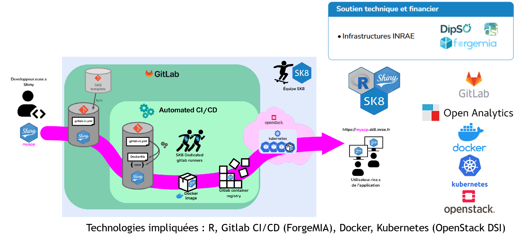
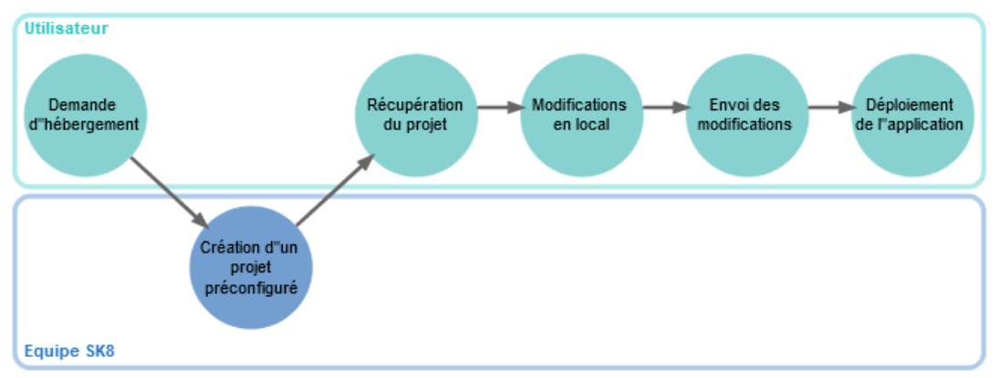

```{r setup, include=FALSE}
library(learnr)
```

## Shiny Quizz  

### Shiny application/structure

```{r shiny-quizz-0, echo=FALSE}
quiz(
  question("Qu'est-ce que Shiny?", 
    answer("Un framework pour créer des applications web interactives avec R", 
           correct = TRUE,
           message = "[Shiny for R](https://shiny.posit.co/)"),
    answer("Une espèce de pokémon rare", 
           message = "Il existe bien des pokémon dits chromatiques (brillants ou encore shiny): [pour en savoir plus](https://www.pokepedia.fr/Pok%C3%A9mon_chromatique), mais ce n'est pas la réponse attendue."),
    answer("Une crème contre les rayons bleus des écrans",
           message = "Il existe bien des crèmes pour protéger la peau des rayons UV, mais ce n'est pas la réponse attendue."),
    answer("Un framework pour créer des applications web interactives avec Python", 
           correct = TRUE, 
           message = "[Shiny for Python](https://shiny.posit.co/py/)"),
    allow_retry = TRUE
  ),
  question("Combien de composants sont nécessaires pour créer une application Shiny ?", 
    answer("1", message = "un seul composant ne suffit pas pour créer une application Shiny"),
    answer("2", correct = TRUE,
           message = "[Two-file Shiny apps](https://shiny.posit.co/r/articles/build/two-file/)"),
    answer("3", message = "trois composants ne sont pas nécessaires pour créer une application Shiny"),
    answer("4", message = "quatre composants ne sont pas nécessaires pour créer une application Shiny"),
    allow_retry = TRUE
  ),
  question("Quels sont les deux composants nécessaires pour créer une application Shiny ?", 
    answer("ui.R et server.R", 
           correct = TRUE,
           message = "[Two-file Shiny apps](https://shiny.posit.co/r/articles/build/two-file/)"),
    answer("ui.R et app.R",
           message = "c'est presque ça, mais il manque un composant"),
    answer("server.R et app.R",
           message = "c'est presque ça, mais il manque un composant"),
    answer("hihi.R et byebye.R", 
           message = "sérieusement ?"),
    allow_retry = TRUE
  ),
  question("Quel est le composant qui permet de définir l'interface utilisateur dans une application Shiny ?", 
    answer("ui.R", 
           correct = TRUE,
           message = "[ui.R](https://shiny.posit.co/r/getstarted/build-an-app/hello-shiny/user-interface.html)"),
    answer("server.R",
           message = "pour le serveur comme le dit le nom de fichier"),
    answer("app.R",
           message = "app.R est un fichier qui permet de combiner ui.R et server.R"),
    answer("ui.R et server.R",
           message = "ui.R et server.R sont les deux composants nécessaires pour créer une application Shiny"),
    allow_retry = TRUE
  ),
  question("Quel est le composant qui permet de définir le serveur dans une application Shiny ?", 
    answer("server.R", 
           correct = TRUE,
           message = "[server.R](https://shiny.posit.co/r/getstarted/build-an-app/hello-shiny/server-function.html)"),
    answer("ui.R",
           message = "pour l'interface utilisateur comme le dit le nom de fichier"),
    answer("app.R",
           message = "app.R est un fichier qui permet de combiner ui.R et server.R"),
    answer("ui.R et server.R",
           message = "ui.R et server.R sont les deux composants nécessaires pour créer une application Shiny"),
    allow_retry = TRUE
  )
)
```

### UI layout

```{r shiny-quizz-1, echo=FALSE}
quiz(
  question("En combien de colonnes est divisée une ligne dans une application Shiny ?", 
    answer("5",
           message = "beaucoup plus"),
    answer("8",
           message = "bien plus"),
    answer("9",
           message = "encore plus"),
    answer("12", correct = TRUE,
           message = "[grid with of a column should be between 1 and 12](https://rstudio.github.io/shiny/reference/column.html)"),
    allow_retry = TRUE
  ),
  question("Quelle fonction permet de créer une page avec une barre latérale dans une application Shiny ?", 
    answer("sidebarLayout", 
           correct = TRUE,
           message = "[voir sidebarLayout](https://rstudio.github.io/shiny/reference/sidebarLayout.html)"),
    answer("pageWithSidebar", message="[déprécié](https://shiny.posit.co/r/reference/shiny/latest/pagewithsidebar), utiliser sidebarLayout"),
    answer("pageWithFooter",
           message = "pageWithFooter n'existe pas"),
    answer("fluidPage",
           message = "fluidPage permet de créer une page avec un contenu fluide: [voir fluidPage](https://rstudio.github.io/shiny/reference/fluidPage.html)"),
    allow_retry = TRUE
  ),
  question("Quelles fonctions permettent de créer un layout multipages dans une application Shiny ?", 
    answer("navbarPage", 
           correct = TRUE,
           message = "[navbarPage](https://rstudio.github.io/shiny/reference/navbarPage.html)"),
    answer("tabsetPanel", 
           correct = TRUE,
           message = "[tabsetPanel](https://shiny.posit.co/r/reference/shiny/latest/tabsetpanel)"),
    answer("navlistPanel", 
           correct = TRUE,
           message = "[navlistPanel](https://rstudio.github.io/shiny/reference/navlistPanel.html)"),
    answer("fluidPanel",
           message = "fluidPanel n'existe pas"),
    allow_retry = TRUE,
    random_answer_order = TRUE
  ),
  question("Quels sont les frameworks pour développer des dashboards en shiny?", 
    answer("shinydashboard", 
           correct = TRUE,
           message = "[shinydashboard](https://rstudio.github.io/shinydashboard/)"),
    answer("shinybootstrap",
           message = "shinybootstrap n'existe pas"),
    answer("shiny.semantic", 
           correct = TRUE,
           message = "[shiny.semantic](https://appsilon.github.io/shiny.semantic/)"),
    answer("bslib", 
           correct = TRUE,
           message = "[bslib](https://rstudio.github.io/bslib/)"),
    answer("bs4Dash", 
           correct = TRUE,
           message = "[bs4Dash](https://rinterface.github.io/bs4Dash/index.html)"),
    allow_retry = TRUE,
    random_answer_order = TRUE
    )
)
```

### UI input functions

```{r shiny-quizz-2, echo=FALSE}
quiz(
  question("Quelle fonction permet de créer un champ de texte dans une application Shiny ?", 
    answer("wordInput",
           message = "wordInput n'existe pas"),
    answer("selectInput",
           message = "selectInput permet de créer un menu déroulant: [voir selectInput](https://rstudio.github.io/shiny/reference/selectInput.html)"),
    answer("numericInput",
           message = "numericInput permet de créer un champ numérique: [voir numericInput](https://rstudio.github.io/shiny/reference/numericInput.html)"),
    answer("textInput", 
           correct = TRUE,
           message = "[voir textInput](https://rstudio.github.io/shiny/reference/textInput.html)"),
    allow_retry = TRUE,
    random_answer_order = TRUE
  ),
  question("Quelle fonction permet de créer un menu déroulant dans une application Shiny ?",
    answer("wordInput",
           message = "wordInput n'existe pas"),
    answer("selectInput", 
           correct = TRUE,
           message = "[voir selectInput](https://rstudio.github.io/shiny/reference/selectInput.html)"),
    answer("numericInput",
           message = "numericInput permet de créer un champ numérique: [voir numericInput](https://rstudio.github.io/shiny/reference/numericInput.html)"),
    answer("textInput",
           message = "textInput permet de créer un champ de texte: [voir textInput](https://rstudio.github.io/shiny/reference/textInput.html)"),
    allow_retry = TRUE,
    random_answer_order = TRUE
  ),
  question("Quelle fonction permet de créer un champ numérique dans une application Shiny ?",
    answer("wordInput",
           message = "wordInput n'existe pas"),
    answer("selectInput", 
           message = "selectInput permet de créer un menu déroulant: [voir selectInput](https://rstudio.github.io/shiny/reference/selectInput.html)"),
    answer("numericInput", 
           correct = TRUE,
           message = "[voir numericInput](https://rstudio.github.io/shiny/reference/numericInput.html)"),
    answer("textInput"),
    allow_retry = TRUE,
    random_answer_order = TRUE
  ),
  question("Quels sont les types d'input disponibles dans une application Shiny ?",
    answer("text", 
           correct = TRUE,
           message = "[voir text](https://rstudio.github.io/shiny/reference/textInput.html)"),
    answer("numeric", 
           correct = TRUE,
           message = "[voir numeric](https://rstudio.github.io/shiny/reference/numericInput.html)"),
    answer("date", 
           correct = TRUE,
           message = "[voir date](https://rstudio.github.io/shiny/reference/dateInput.html)"),
    answer("box", 
           message = "box n'est pas un type d'input"),
    answer("email", 
           message = "email n'est pas un type d'input"),
    answer("checkbox", 
           correct = TRUE,
           message = "[voir checkbox](https://rstudio.github.io/shiny/reference/checkboxInput.html)"),
    answer("radio", 
           correct = TRUE,
           message = "[voir radio](https://rstudio.github.io/shiny/reference/radioButtons.html)"),
    answer("address"),
    answer("file", 
           correct = TRUE,
           message = "[voir file](https://rstudio.github.io/shiny/reference/fileInput.html)"),
    allow_retry = TRUE,
    random_answer_order = TRUE
    ),
  question("Quelle fonction permet de créer un curseur numérique dans une application Shiny ?",
    answer("sliderInput", 
           correct = TRUE,
           message = "[voir sliderInput](https://rstudio.github.io/shiny/reference/sliderInput.html)"),
    answer("selectInput",
           message = "selectInput permet de créer un menu déroulant: [voir selectInput](https://rstudio.github.io/shiny/reference/selectInput.html)"),
    answer("numericInput",
           message = "numericInput permet de créer un champ numérique: [voir numericInput](https://rstudio.github.io/shiny/reference/numericInput.html)"),
    answer("textInput",
           message = "textInput permet de créer un champ de texte: [voir textInput](https://rstudio.github.io/shiny/reference/textInput.html)"),
    allow_retry = TRUE,
    random_answer_order = TRUE
  )
)

```

### Server rendering functions

```{r shiny-quizz-3, echo=FALSE}
quiz(
  question("Quelle est la fonction qui permet de générer un graphique dans une application Shiny ?", 
    answer("renderPlot", 
           correct = TRUE,
           message = "[renderPlot](https://rstudio.github.io/shiny/reference/renderPlot.html)"),
    answer("renderTable",
           message = "renderTable permet de générer un tableau: [voir renderTable](https://rstudio.github.io/shiny/reference/renderTable.html)"),
    answer("renderPrint",
           message = "renderPrint permet de générer un texte: [voir renderPrint](https://rstudio.github.io/shiny/reference/renderPrint.html)"),
    answer("renderDataTable",
           message = "renderDataTable permet de générer un tableau dynamique: [voir renderDataTable](https://rstudio.github.io/shiny/reference/renderDataTable.html)"),
    allow_retry = TRUE,
    random_answer_order = TRUE
  ),
  question("Quelle est la fonction qui permet de générer un tableau dans une application Shiny ?", 
    answer("renderTable", 
           correct = TRUE,
           message = "[renderTable](https://rstudio.github.io/shiny/reference/renderTable.html)"),
    answer("renderPlot",
           message = "renderPlot permet de générer un graphique: [voir renderPlot](https://rstudio.github.io/shiny/reference/renderPlot.html)"),
    answer("renderPrint",
           message = "renderPrint permet de générer un texte: [voir renderPrint](https://rstudio.github.io/shiny/reference/renderPrint.html)"),
    answer("renderDataTable",
           message = "renderDataTable permet de générer un tableau dynamique: [voir renderDataTable](https://rstudio.github.io/shiny/reference/renderDataTable.html)"),
    allow_retry = TRUE,
    random_answer_order = TRUE
  ),
  question("Quelle est la fonction qui permet de générer un texte dans une application Shiny ?", 
    answer("renderPrint", 
           correct = TRUE,
           message = "[renderPrint](https://rstudio.github.io/shiny/reference/renderPrint.html)"),
    answer("renderTable",
           message = "renderTable permet de générer un tableau: [voir renderTable](https://rstudio.github.io/shiny/reference/renderTable.html)"),
    answer("renderPlot",
           message = "renderPlot permet de générer un graphique: [voir renderPlot](https://rstudio.github.io/shiny/reference/renderPlot.html)"),
    answer("renderDataTable",
           message = "renderDataTable permet de générer un tableau dynamique: [voir renderDataTable](https://rstudio.github.io/shiny/reference/renderDataTable.html)"),
    allow_retry = TRUE,
    random_answer_order = TRUE
  ),
  question("Quelle est la fonction qui permet de générer un tableau dynamique dans une application Shiny ?", 
    answer("renderDataTable", 
           correct = TRUE,
           message = "[renderDataTable](https://rstudio.github.io/shiny/reference/renderDataTable.html)"),
    answer("renderTable",
           message = "renderTable permet de générer un tableau: [voir renderTable](https://rstudio.github.io/shiny/reference/renderTable.html)"),
    answer("renderPrint",
           message = "renderPrint permet de générer un texte: [voir renderPrint](https://rstudio.github.io/shiny/reference/renderPrint.html)"),
    answer("renderPlot",
           message = "renderPlot permet de générer un graphique: [voir renderPlot](https://rstudio.github.io/shiny/reference/renderPlot.html)"),
    allow_retry = TRUE,
    random_answer_order = TRUE
  )
)

```

### UI output functions

```{r shiny-quizz-4, echo=FALSE}
quiz(
  question("Quelle fonction permet de générer un graphique dans une application Shiny ?", 
    answer("plotOutput", 
           correct = TRUE,
           message = "[plotOutput](https://rstudio.github.io/shiny/reference/plotOutput.html)"),
    answer("tableOutput",
           message = "tableOutput permet de générer un tableau: [voir tableOutput](https://rstudio.github.io/shiny/reference/renderTable.html)"),
    answer("textOutput",
           message = "textOutput permet de générer un texte: [voir printOutput](https://rstudio.github.io/shiny/reference/renderPrint.html)"),
    answer("dataTableOutput",
           message = "dataTableOutput permet de générer un tableau dynamique: [voir dataTableOutput](https://rstudio.github.io/shiny/reference/renderDataTable.html)"),
    allow_retry = TRUE,
    random_answer_order = TRUE
  ),
  question("Quelle fonction permet de générer un tableau dans une application Shiny ?", 
    answer("tableOutput", 
           correct = TRUE,
           message = "[tableOutput](https://rstudio.github.io/shiny/reference/renderTable.html)"),
    answer("plotOutput",
           message = "plotOutput permet de générer un graphique: [voir plotOutput](https://rstudio.github.io/shiny/reference/plotOutput.html)"),
    answer("textOutput",
           message = "textOutput permet de générer un texte: [voir textOutput](https://rstudio.github.io/shiny/reference/renderPrint.html)"),
    answer("dataTableOutput",
           message = "dataTableOutput permet de générer un tableau dynamique: [voir dataTableOutput](https://rstudio.github.io/shiny/reference/renderDataTable.html)"),
    allow_retry = TRUE,
    random_answer_order = TRUE
  ),
  question("Quelles fonctions permettent de générer un texte dans une application Shiny ?", 
    answer("textOutput", 
           correct = TRUE,
           message = "[printOutput](https://rstudio.github.io/shiny/reference/renderPrint.html)"),
    answer("tableOutput",
           message = "tableOutput permet de générer un tableau: [voir tableOutput](https://rstudio.github.io/shiny/reference/renderTable.html)"),
    answer("verbatimTextOutput", 
           correct = TRUE,
           message = "[verbatimTextOutput](https://rstudio.github.io/shiny/reference/renderPrint.html)"),
    answer("dataTableOutput",
           message = "dataTableOutput permet de générer un tableau dynamique: [voir dataTableOutput](https://rstudio.github.io/shiny/reference/renderDataTable.html)"),
    allow_retry = TRUE,
    random_answer_order = TRUE
  ),
  question("Quelle fonction permet de générer un tableau dynamique dans une application Shiny ?", 
    answer("dataTableOutput", 
           correct = TRUE,
           message = "[dataTableOutput](https://rstudio.github.io/shiny/reference/renderDataTable.html)"),
    answer("tableOutput",
           message = "tableOutput permet de générer un tableau: [voir tableOutput](https://rstudio.github.io/shiny/reference/renderTable.html)"),
    answer("textOutput",
           message = "textOutput permet de générer un texte: [voir textOutput](https://rstudio.github.io/shiny/reference/renderPrint.html)"),
    answer("plotOutput",
           message = "plotOutput permet de générer un graphique: [voir plotOutput](https://rstudio.github.io/shiny/reference/plotOutput.html)"),
    allow_retry = TRUE,
    random_answer_order = TRUE
  )
)
```

### Expressions réactives

```{r shiny-quizz-5, echo=FALSE}
quiz(
  question("Quelle fonction permet de créer une dépendance entre un input côté UI et une autre expression côté serveur dans une application Shiny ?", 
    answer("reactive", 
           correct = TRUE,
           message = "[reactive](https://rstudio.github.io/shiny/reference/reactive.html)"),
    answer("radioactive",
           message = "radioactive n'est pas une fonction de Shiny"),
    answer("renderactive",
           message = "renderactive n'est pas une fonction de Shiny"),
    answer("proactive",
           message = "proactive n'est pas une fonction de Shiny"),
    allow_retry = TRUE,
    random_answer_order = TRUE
  ),
  question("Quelle fonction reactive permet d'isoler une action dans une application Shiny ?", 
    answer("isolate", 
           correct = TRUE,
           message = "[isolate](https://rstudio.github.io/shiny/reference/isolate.html)"),
    answer("cache-cache",
           message = "cache-cache n'est pas une fonction de Shiny, mais vous connaissez bien le jeu"),
    answer("lockdown",
           message = "lockdown n'est pas une fonction de Shiny, mais vous connaissez bien le confinement"),
    answer("iwanttobreakfree",
           message = "iwanttobreakfree n'est pas une fonction de Shiny, mais vous connaissez bien la chanson"),
    allow_retry = TRUE,
    random_answer_order = TRUE
  ),
  question("Quelle fonction reactive permet de générer une dépendance à une seule variable dans une application Shiny ?", 
    answer("reactiveVal", 
           correct = TRUE,
           message = "[reactiveVal](https://rstudio.github.io/shiny/reference/reactiveVal.html)"),
    answer("reactiveValues", 
           message = "reactiveValues() est une fonction qui permet de stocker plusieurs valeurs réactives [reactiveValues](https://rstudio.github.io/shiny/reference/reactiveValues.html)"),
    answer("reactorVal",
           message = "reactorVal n'est pas une fonction de Shiny"),
    answer("proactorValues",
           message = "proactorValues n'est pas une fonction de Shiny"),
    allow_retry = TRUE,
    random_answer_order = TRUE
  ),
  question("Quand peut-on utiliser la fonction observe() dans une application Shiny ?",
    answer("Pour modifier un object reactiveValues", 
           correct = TRUE,
           message = "[observe](https://rstudio.github.io/shiny/reference/observe.html)"),
    answer("Pour déclencher l'affichage d'une fenêtre contextuelle", 
           correct = TRUE,
           message = "[observe](https://rstudio.github.io/shiny/reference/observe.html)"),
    answer("Pour envoyer un email",
           message = "observe() n'est pas une fonction pour envoyer un email"),
    answer("Pour modifier un élément de l'interface utilisateur",
           message = "observe() n'est pas une fonction pour modifier un élément de l'interface utilisateur"),
    allow_retry = TRUE,
    random_answer_order = TRUE
  ),
  question("Quelle(s) fonction(s) reactive permet(tent) de générer une dépendance à un évènement et d'éxécuter une action dans une application Shiny ?", 
    answer("observeEvent", 
           correct = TRUE,
           message = "[observeEvent](https://rstudio.github.io/shiny/reference/observeEvent.html)"),
    answer("observe",
           message = "observe() n'est pas une fonction pour générer une dépendance à un évènement"),
    answer("eventReactive", 
           correct = TRUE,
           message = "[eventReactive](https://rstudio.github.io/shiny/reference/observeEvent.html)"),
    answer("observeInput",
           message = "observeInput n'est pas une fonction pour générer une dépendance à un évènement"),
    answer("reactiveEvent",
           message = "reactiveEvent n'est pas une fonction pour générer une dépendance à un évènement"),
    answer("bindEvent",
           correct = TRUE,
           message = "[bindEvent](https://rstudio.github.io/shiny/reference/observeEvent.html)"),
    allow_retry = TRUE,
    random_answer_order = TRUE
  )
)
```

### Déployer une application Shiny

```{r shiny-quizz-6, echo=FALSE}
quiz(
  question("Quelles sont les solutions existantes pour déployer une application Shiny ?", 
    answer("Shinyapps.io", 
           correct = TRUE,
           message = "[Shinyapps.io](https://www.shinyapps.io/)"),
    answer("Posit Connect", 
           correct = TRUE,
           message = "[Posit Connect](https://posit.co/products/enterprise/connect/)"),
    answer("Shiny Server", 
           correct = TRUE,
           message = "[Shiny Server](https://www.rstudio.com/products/shiny/shiny-server/)"),
    answer("Shiny Cloud",
           message = "Shiny Cloud n'existe pas"),
    allow_retry = TRUE,
    random_answer_order = TRUE
  ),
  question("Quelles solutions de déploiement utilise docker pour déployer une application Shiny ?", 
    answer("shinyproxy", 
           correct = TRUE,
           message = "[shinyproxy](https://www.shinyproxy.io/)"),
    answer("Posit Connect",
           message = "Posit Connect n'utilise pas docker pour déployer une application Shiny"),
    answer("Shiny Server",
           message = "Shiny Server n'utilise pas docker pour déployer une application Shiny"),
    answer("SK8", 
           correct = TRUE,
           message = "SK8 utilise une infrastructure basé sur docker/Kubernetes pour déployer une application Shiny [SK8](https://sk8.inrae.fr)"),
    answer("binder", 
           correct = TRUE,
           message = "binder utilise une infrastructure basé sur docker pour déployer une application Shiny [binder](https://mybinder.org)"),
    answer("Hugging Face Spaces", 
           correct = TRUE,
           message = "Hugging Face Spaces utilise une infrastructure basé sur docker pour déployer une application Shiny [Hugging Face Spaces](https://huggingface.co/spaces)"),
    allow_retry = TRUE,
    random_answer_order = TRUE
  )
)

```

## Tutorial introduction

### Iris dataset

Pour le tutoriel, nous allons utiliser un jeu de données intégré à R, nommé Iris. Il recense les tailles de pétales et de sépales pour un ensemble d'individus "iris" de trois espèces différentes, setosa, versicolor et virginica.

Exécuter le code suivant, bouton `Run code`, pour afficher les premières lignes du jeu de données:

```{r iris, exercise=TRUE}
head(iris)
```

## Développer une application Shiny

### Créer une application Shiny

Créer un répertoire pour l’application avec **RStudio**.

```bash
File -> New Project -> New Directory -> Shiny Web Application
```

Choisir une application **Multiple File**.

Si cette option n’est pas disponible (ça peut dépendre des versions de Rstudio), on pourra utiliser

```bash
File -> New File -> Shiny Web App -> Multiple File
```

Deux fichier sont automatiquement générés : `ui.R` et `server.R`. Lancer l’application en cliquant sur le bouton `Run App`.

  * Changer le titre de l’application. On pourra l’appeler My first application.
  * Mettre à jour et vérifier que le titre a bien été changé.
    
### ui.R

Voici un exemple de `ui.R` que nous allons utiliser. Lancer le code avec le bouton `Run code` pour voir le rendu.

```{r ui_R, exercise=TRUE, exercise.lines=20, eval=FALSE}
# k-means only works with numerical variables,
# so don't give the user the option to select
# a categorical variable
vars <- setdiff(names(iris), "Species")

pageWithSidebar(
  headerPanel('Iris k-means clustering'),
  sidebarPanel(
    selectInput('xcol', 'X Variable', vars),
    selectInput('ycol', 'Y Variable', vars, selected = vars[[2]]),
    numericInput('clusters', 'Cluster count', 3, min = 1, max = 9)
  ),
  mainPanel(
    tabsetPanel(type = "tabs",
                tabPanel("Plot", plotOutput('plot1')),
                tabPanel("Summary", verbatimTextOutput("summary")),
                tabPanel("Table", tableOutput("table"))
    )
  )
)
```

### server.R

Exemple de fichier server.R vide : 

```{r server_R, exercise=FALSE, eval=FALSE}
function(input, output, session) {

}
```

Il s'agit maintenant de remplir le fichier server.R pour obtenir des résultats dans les tabPanel "Plot", "Summary" et "Table".  

### Générer un tableau dynamique dans une fonction reactive({})

Créer une reactive avec reactive({}) pour générer un tableau dynamique récupérant les 2 colonnes correspondant aux variables X et Y sélectionnées par l’utilisateur sur les données iris et ranger ce tableau dans une variable « selectedData »

```{r server_R_selected_data, exercise=TRUE, exercise.warn_invisible=TRUE}
# function(input, output, session) {
# ajouter votre code ci-dessous

# }
```

```{r server_R_selected_data-hint-1}
# function(input, output, session) {
# ajouter votre code ci-dessous

  # Combine the selected variables into a new data frame
  selectedData <- reactive({...})

# }
```

```{r server_R_selected_data-hint-2}
# function(input, output, session) {
# ajouter votre code ci-dessous

  # Combine the selected variables into a new data frame
  selectedData <- reactive({
    iris[, ... ]
})

# }
```

```{r server_R_selected_data-hint-3}
# function(input, output, session) {
# ajouter votre code ci-dessous

  # Combine the selected variables into a new data frame
  selectedData <- reactive({
    iris[, c(input$xcol, input$ycol)]
})

# }
```

```{r server_R_selected_data-solution}
# function(input, output, session) {
# ajouter votre code ci-dessous

  # Combine the selected variables into a new data frame
  selectedData <- reactive({
    iris[, c(input$xcol, input$ycol)]
  })

# }
```

### Solution

Et voilà ce que contient `selectedData`:

```{r server_R_selected_data-display, echo=FALSE}
vars <- setdiff(names(iris), "Species")

pageWithSidebar(
  headerPanel('Iris: select data'),
  sidebarPanel(
    selectInput('xcol_sd', 'X Variable', vars),
    selectInput('ycol_sd', 'Y Variable', vars, selected = vars[[2]]),
    numericInput('clusters_sd', 'Cluster count', 3, min = 1, max = 9)
  ),
  mainPanel(
    tabsetPanel(type = "tabs",
                tabPanel("Selected data", DT::dataTableOutput("sd_selectedData"))
    )
  )
)
```

```{r server_R_selected_data-print, echo=TRUE, context = "server"}
# function(input, output, session) {
# ajouter votre code ci-dessous

  # Combine the selected variables into a new data frame
  selectedData <- reactive({
    iris[, c(input$xcol_sd, input$ycol_sd)]
  })

  output$sd_selectedData <- DT::renderDataTable(
    DT::datatable(
      selectedData(),
      options = list(
        dom = 'Bfrtip',
        lengthMenu = list(c(5, 15, -1), c('5', '15', 'All')),
        pageLength = 15,
        buttons = list(
            list(
              extend = "collection",
              text = 'Show All',
              action = DT::JS("function ( e, dt, node, config ) {
                                    dt.page.len(-1);
                                    dt.ajax.reload();
                                }")
            )
          )
        )
    )
  )
  
# }
```

### Générer un tableau des données sélectionnées pour le graphique

Afficher le tableau dynamique avec renderTable{()} représentant le tableau utilisé pour générer le graphique et ranger le résultat dans output$table. Représenter cette table côté UI dans le tabPanel « Table ».  

```{r server_R_render_table, exercise=TRUE, context = "server", exercise.warn_invisible=TRUE}
# function(input, output, session) {
# ajouter votre code ci-dessous

# }
```

```{r server_R_render_table-hint-1}
# function(input, output, session) {
# ajouter votre code ci-dessous

  output$table <- renderTable({...})

# }
```

```{r server_R_render_table-hint-2}
# function(input, output, session) {
# ajouter votre code ci-dessous

  output$table <- renderTable({
    selectedData()
  })

# }
```

```{r server_R_render_table-solution}
# function(input, output, session) {
# ajouter votre code ci-dessous
  
  output$table <- renderTable({
    selectedData()
  })

# }
```

### Solution

Et voilà ce que contient `output$table`:

```{r server_R_render_table-display, echo=FALSE}
vars <- setdiff(names(iris), "Species")

pageWithSidebar(
  headerPanel('Iris: print selected data table'),
  sidebarPanel(
    selectInput('xcol_tbl', 'X Variable', vars),
    selectInput('ycol_tbl', 'Y Variable', vars, selected = vars[[2]]),
    numericInput('clusters_tbl', 'Cluster count', 3, min = 1, max = 9)
  ),
  mainPanel(
    tabsetPanel(type = "tabs",
                  tabPanel("Table", DT::dataTableOutput("tbl_selectedData"))
    )
  )
)
```

```{r server_R_render_table-print, context = "server"}
# function(input, output, session) {
# ajouter votre code ci-dessous

  # Combine the selected variables into a new data frame
  tblselectedData <- reactive({
    iris[, c(input$xcol_tbl, input$ycol_tbl)]
  })

  output$tbl_selectedData <- DT::renderDataTable(
    DT::datatable(
      tblselectedData(),
      options = list(
        dom = 'Bfrtip',
        lengthMenu = list(c(5, 15, -1), c('5', '15', 'All')),
        pageLength = 15,
        buttons = list(
            list(
              extend = "collection",
              text = 'Show All',
              action = DT::JS("function ( e, dt, node, config ) {
                                    dt.page.len(-1);
                                    dt.ajax.reload();
                                }")
            )
          )
        )
    )
  )

# }
```

### Générer un résumé statistique du tableau dynamique

Générer un texte dynamique avec renderPrint({}) représentant un résumé statistique du tableau dynamique généré précédemment avec la fonction summary() et ranger le résultat dans output$summary, puis le représenter côté UI dans le tabPanel « Summary ».

```{r server_R_render_print, exercise=TRUE, context = "server", exercise.warn_invisible=TRUE}
# function(input, output, session) {
# ajouter votre code ci-dessous

# }
```

```{r server_R_render_print-hint-1}
# function(input, output, session) {
# ajouter votre code ci-dessous

  # Generate a summary of the data ----
  output$summary <- renderPrint({...})

# }
```

```{r server_R_render_print-hint-2}
# function(input, output, session) {
# ajouter votre code ci-dessous

  # Generate a summary of the data ----
  output$summary <- renderPrint({
    summary(...)
  })

# }
```

```{r server_R_render_print-hint-3}
# function(input, output, session) {
# ajouter votre code ci-dessous

  # Generate a summary of the data ----
  output$summary <- renderPrint({
    summary(selectedData())
  })

# }
```

```{r server_R_render_print-solution}
# function(input, output, session) {
# ajouter votre code ci-dessous
  
  # Generate a summary of the data ----
  output$summary <- renderPrint({
    summary(selectedData())
  })
  
# }
```

### Solution

Et voilà ce que contient `output$summary`:

```{r server_R_render_print-display, echo=FALSE}
vars <- setdiff(names(iris), "Species")

pageWithSidebar(
  headerPanel('Iris k-means clustering'),
  sidebarPanel(
    selectInput('xcol_smry', 'X Variable', vars),
    selectInput('ycol_smry', 'Y Variable', vars, selected = vars[[2]]),
    numericInput('clusters_smry', 'Cluster count', 3, min = 1, max = 9)
  ),
  mainPanel(
    tabsetPanel(type = "tabs",
                  tabPanel("Summary", verbatimTextOutput("print_summary"))
    )
  )
)
```

```{r server_R_render_print-print, context = "server"}
# function(input, output, session) {
# ajouter votre code ci-dessous

  # Combine the selected variables into a new data frame
  smryselectedData <- reactive({
    iris[, c(input$xcol_smry, input$ycol_smry)]
  })

  smryclusters <- reactive({
    kmeans(smryselectedData(), input$clusters_smry)
  })

  output$print_summary <- renderPrint({
    summary(smryselectedData())
  })
  
# }
```

### Générer le clustering k-means dans une fonction reactive({})

Créer une reactive avec reactive({}) pour générer un cluster sur le tableau dynamique précédent, utilisant la variable « Cluster count » comme nombre de clusters à créer et ranger ce résultat dans une variable « clusters ». Utiliser la fonction kmeans() pour générer ces clusters.

```{r server_R_clusters, exercise=TRUE, exercise.warn_invisible=TRUE}
# function(input, output, session) {
# ajouter votre code ci-dessous

# }
```

```{r server_R_clusters-hint-1}
# function(input, output, session) {
# ajouter votre code ci-dessous

  clusters <- reactive({...})

# }
```

```{r server_R_clusters-hint-2}
# function(input, output, session) {
# ajouter votre code ci-dessous

  clusters <- reactive({
    kmeans(...)
  })

# }
```

```{r server_R_clusters-hint-3}
# function(input, output, session) {
# ajouter votre code ci-dessous
  
  clusters <- reactive({
    kmeans(selectedData(), input$clusters)
  })

# }
```

```{r server_R_clusters-solution}
# function(input, output, session) {
# ajouter votre code ci-dessous
  
  clusters <- reactive({
    kmeans(selectedData(), input$clusters)
  })

# }
```

### Solution

Et voilà ce que contient `clusters`:

```{r server_R_clusters-display, echo=FALSE}
vars <- setdiff(names(iris), "Species")

pageWithSidebar(
  headerPanel('Iris print k-means clustering results'),
  sidebarPanel(
    selectInput('xcol_km', 'X Variable', vars),
    selectInput('ycol_km', 'Y Variable', vars, selected = vars[[2]]),
    numericInput('clusters_km', 'Cluster count', 3, min = 1, max = 9)
  ),
  mainPanel(
    tabsetPanel(type = "tabs",
                  tabPanel("K-means clusters", verbatimTextOutput("km_clusters"))
    )
  )
)
```

```{r server_R_clusters-print, context = "server"}
# function(input, output, session) {
# ajouter votre code ci-dessous

  # Combine the selected variables into a new data frame
  kmselectedData <- reactive({
    iris[, c(input$xcol_km, input$ycol_km)]
  })

  kmclusters <- reactive({
    kmeans(kmselectedData(), input$clusters_km)
  })

  output$km_clusters <- renderPrint({
    kmclusters()
  })
  
# }
```

### Générer le plot dynamique du clustering kmeans  

Générer un graphique dynamique avec renderPlot{()} représentant le tableau dynamique avec la fonction plot() et colorer les points selon le cluster auquel ils appartiennent avec le paramètre « col ». Pour récupérer les clusters depuis la variable « clusters », utiliser clusters()\$cluster. Ranger le résultat dans output\$plot1 et le représenter côté UI dans le tabPanel « Plot ».

```{r server_R_render_plot, exercise=TRUE, exercise.warn_invisible=TRUE}
# function(input, output, session) {
# ajouter votre code ci-dessous

# }
```

```{r server_R_render_plot-hint-1}
# function(input, output, session) {
# ajouter votre code ci-dessous

  output$plot1 <- renderPlot({...})

# }
```

```{r server_R_render_plot-hint-2}
# function(input, output, session) {
# ajouter votre code ci-dessous

  output$plot1 <- renderPlot({
    # create a 9 colors palette
    palette(...)
    
  })

# }
```

```{r server_R_render_plot-hint-3}
# function(input, output, session) {
# ajouter votre code ci-dessous

  output$plot1 <- renderPlot({
    # create a 9 colors palette
    palette(...)
    
    # define margins: replace *_margin placeholders by real values
    par(mar = c(bottom_margin, left_margin, top_margin, right_margin))
  })

# }
```

```{r server_R_render_plot-hint-4}
# function(input, output, session) {
# ajouter votre code ci-dessous

  output$plot1 <- renderPlot({
    # create a 9 colors palette
    palette(...)
    
    # define margins: replace *_margin placeholders by real values
    par(mar = c(bottom_margin, left_margin, top_margin, right_margin))
    
    # create the plot
    plot(selectedData(),
         ...)
    
  })

# }
```

```{r server_R_render_plot-hint-5}
# function(input, output, session) {
# ajouter votre code ci-dessous

  output$plot1 <- renderPlot({
    # create a 9 colors palette
    palette(...)
    
    # define margins: replace *_margin placeholders by real values
    par(mar = c(bottom_margin, left_margin, top_margin, right_margin))
    
    # create the plot: set the points color, shape, etc.
    plot(selectedData(),
         ...)
    # add the cluster centers: set the points color, shape, etc. 
    points(clusters()$centers, ...)
  })

# }
```

```{r server_R_render_plot-hint-6}
# function(input, output, session) {
# full solution

  output$plot1 <- renderPlot({
    palette(c("#E41A1C", "#377EB8", "#4DAF4A", "#984EA3",
              "#FF7F00", "#FFFF33", "#A65628", "#F781BF", "#999999"))
    
    par(mar = c(5.1, 4.1, 0, 1))
    plot(selectedData(),
         col = clusters()$cluster,
         pch = 20, cex = 3)
    points(clusters()$centers, pch = 4, cex = 4, lwd = 4)
  })

# }
```

```{r server_R_render_plot-solution, context="server"}
# function(input, output, session) {
# ajouter votre code ci-dessous
  
  output$plot1 <- renderPlot({
    palette(c("#E41A1C", "#377EB8", "#4DAF4A", "#984EA3",
              "#FF7F00", "#FFFF33", "#A65628", "#F781BF", "#999999"))
    
    par(mar = c(5.1, 4.1, 0, 1))
    plot(selectedData(),
         col = clusters()$cluster,
         pch = 20, cex = 3)
    points(clusters()$centers, pch = 4, cex = 4, lwd = 4)
  })

# }
```

### Solution

Et voilà ce que contient `output$plot1`:

```{r server_R_render_plot-display, echo=FALSE}
vars <- setdiff(names(iris), "Species")

pageWithSidebar(
  headerPanel('Iris plot k-means clustering results'),
  sidebarPanel(
    selectInput('xcol_plot', 'X Variable', vars),
    selectInput('ycol_plot', 'Y Variable', vars, selected = vars[[2]]),
    numericInput('clusters_plot', 'Cluster count', 3, min = 1, max = 9)
  ),
  mainPanel(
    tabsetPanel(type = "tabs",
                  tabPanel("K-means clusters plot", plotOutput("km_plot")),
                tabPanel("K-means clusters", verbatimTextOutput("print_clusters"))
    )
  )
)
```

```{r server_R_render_plot-print, context = "server"}
# function(input, output, session) {
# ajouter votre code ci-dessous

  # Combine the selected variables into a new data frame
  plotselectedData <- reactive({
    iris[, c(input$xcol_plot, input$ycol_plot)]
  })

  plotclusters <- reactive({
    kmeans(plotselectedData(), input$clusters_plot)
  })

  output$print_clusters <- renderPrint({
    plotclusters()
  })
  
  output$km_plot <- renderPlot({
    palette(c("#E41A1C", "#377EB8", "#4DAF4A", "#984EA3",
              "#FF7F00", "#FFFF33", "#A65628", "#F781BF", "#999999"))
    
    par(mar = c(5.1, 4.1, 0, 1))
    plot(selectedData(),
         col = plotclusters()$cluster,
         pch = 20, cex = 3)
    points(plotclusters()$centers, pch = 4, cex = 4, lwd = 4)
  })
  
# }
```

## Application Shiny complète

### Lancer une application Shiny

Tips, commande pour lancer une application Shiny dans le dossier contenant les fichiers ui.R et server.R. Avec "." le chemin vers le dossier contenant les deux scripts.

```{r shiny_run_app, exercise=FALSE, eval=FALSE}
shiny::runApp(".")
```

### L'application shiny en démo live  

Si vous avez exécuter la commande `shiny::runApp(".")` dans la console, vous pouvez voir l'application en démo live ci-dessous.

```{r shiny_run_app_demo, echo=FALSE}
# k-means only works with numerical variables,
# so don't give the user the option to select
# a categorical variable
vars <- setdiff(names(iris), "Species")

pageWithSidebar(
  headerPanel('Iris k-means clustering'),
  sidebarPanel(
    selectInput('xcol', 'X Variable', vars),
    selectInput('ycol', 'Y Variable', vars, selected = vars[[2]]),
    numericInput('clusters', 'Cluster count', 3, min = 1, max = 9)
  ),
  mainPanel(
    tabsetPanel(type = "tabs",
                tabPanel("K-means clusters plot", plotOutput('plot1')),
                tabPanel("Summary", verbatimTextOutput("summary")),
                tabPanel("Table", tableOutput("table"))
    )
  )
)

```

```{r shiny_run_app_demo_server, context="server"}
# Combine the selected variables into a new data frame
selectedData <- reactive({
  iris[, c(input$xcol, input$ycol)]
})

clusters <- reactive({
  kmeans(selectedData(), input$clusters)
})

output$plot1 <- renderPlot({
  palette(c("#E41A1C", "#377EB8", "#4DAF4A", "#984EA3",
            "#FF7F00", "#FFFF33", "#A65628", "#F781BF", "#999999"))
  
  par(mar = c(5.1, 4.1, 0, 1))
  plot(selectedData(),
       col = clusters()$cluster,
       pch = 20, cex = 3)
  points(clusters()$centers, pch = 4, cex = 4, lwd = 4)
})

# Generate a summary of the data ----
output$summary <- renderPrint({
  summary(selectedData())
})

output$table <- renderTable({
  selectedData()
})

```

## Déploiement sur SK8  
  
### Rappel sur le workflow SK8 

{width="70%"} 
  
### Déployer une application Shiny sur SK8  
  
{width="70%"}    
Plus d'information sur le site web [https://sk8.inrae.fr](https://sk8.inrae.fr/)  

Pour faire héberger son application sur **SK8**, vous pouvez suivre les étapes décrites sur la page de documentation [Faire une demande d'hébergement](https://docs.sk8.inrae.fr/01-hebergement.html):  
1. [Pré-requis à la demande](https://docs.sk8.inrae.fr/01-hebergement.html#pr%C3%A9-requis-%C3%A0-la-demande)  
2. [Demande d'hébergement](https://docs.sk8.inrae.fr/01-hebergement.html#demande-dh%C3%A9bergement)  

Une fois votre demande validée, vous recevrez un email avec les informations pour vous connecter à votre espace de travail sur **SK8**.

Il faudra ensuite suivre les étapes décrites sur la page de documentation [Travailler avec mon dépôt](https://docs.sk8.inrae.fr/02-monapp.html):  
1. [Contenu du dépôt - template SK8](https://docs.sk8.inrae.fr/02-monapp.html#templatesk8)  
2. [Récupération locale et intégration de vos fichiers ](https://docs.sk8.inrae.fr/02-monapp.html#recupdepot)   
3. [Publier votre application](https://docs.sk8.inrae.fr/02-monapp.html#publier)    
  
Vous retrouverez une information complète sur le pipeline CI/CD de **SK8** sur la page de documentation [Pipeline CI/CD](https://docs.sk8.inrae.fr/021-pipeline.html).  
  
Une fois votre application déployée, vous pourrez la mettre à jour en suivant les étapes décrites sur la page de documentation [Mettre à jour votre application](https://docs.sk8.inrae.fr/02-monapp.html#maj).  
